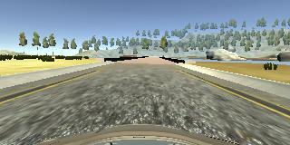
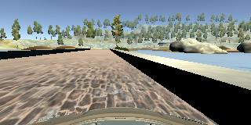
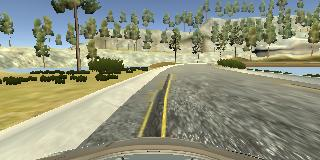
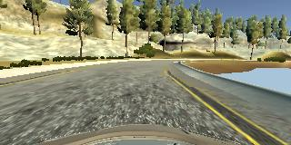
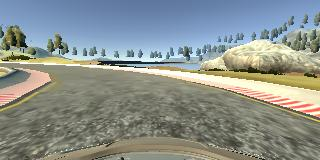
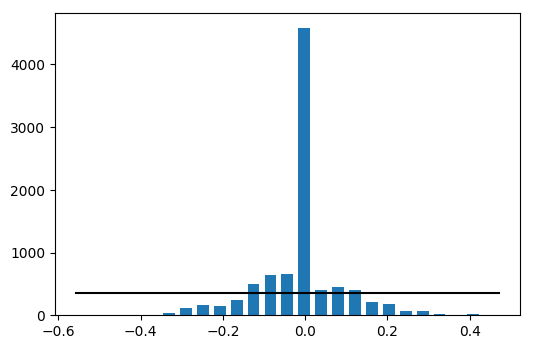
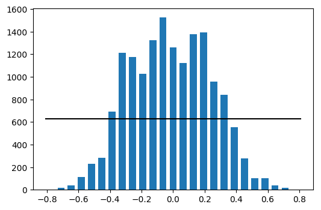

# **Behavioral Cloning** 

## Kemal Tepe, ketepe@gmail.common

### Objective: To build automous driving model from a simulated driving scenarios using Convolutional Neural Networks (CNN).

### Summary:

The idea is to teach a vehicle controller how to drive from actual driving conditions. In this project, training data, images from three different cameras from a simulated vehicle are collected along with steering angles. With this training data, a CNN network is trained and a model is generated using Tensorflow backend with Keras frontend. NVIDIA's published CNN network is sligthly modified to generate the model. The generated model by [model_nvidia.py](./model_nvidia.py) is [model_nvidia.h5](./model_nvidia.h5). The model is used in the simulator and a video clip of the run can be viewed by using movie file [run1.mp4](./run1.mp4), which displays nearly 1.5 lap on the circular course.  


### The goals / steps of this project are the following:
* Use the simulator to collect data of good driving behavior
* Build, a convolution neural network in Keras that predicts steering angles from images
* Train and validate the model with a training and validation set
* Test that the model successfully drives around track one without leaving the road
* Summarize the results with a written report

The entire code can be obtained using [here](./model_nvidia.py). Now we will go to important parts of the steps of the project


#### 1. Use the simulator to collect data of good driving behavior
It is key to get used to the simulator. I have used MAC Bookair to collect data since my laptop (Lenovo Helix) did not have dedicated graphic cars to run the simulation efficiently. I followed instructions provided by the Udacity team: 3-laps in counterclockwise direction, 2-laps in counterclockwise direction, 6-8 sharp turn sections, 10-15 recovering from side to center.

After that, the data needs to be processes, and ugmented which I will talk about in the following sections. However, collecting useful data by mimicing an effective driving is key to clone the behavior.

### 2. Build, a convolution neural network in Keras that predicts steering angles from images

Before moving to the final model, which is derived from [NVIDIA paper](./nvidia_model.pdf) cited in the project site.  The model used is given in Table 1.


|Table 1: Architecture | | |
|---------|--------|--------|
|Layer | Description | Parameters |
|Layer 1| Lambda| normalization, input=160x320x3 | 
|Layer 2| Cropping2D| crop rows, top=40, bottom=20, new size=100x320x3 | 
|Layer 3| CNN 24x5x5 | ELU activiation |
|Layer 4| CNN 36x5x5 | ELU activation|
|Layer 5| CNN 48x5x5 | ELU activation|
|Layer 6| CNN 64x3x3 | ELU activation|
|Layer 7| CNN 64x3x3 | ELU activation|
|Layer 8| Flatten ||
|Layer 9| Dense |100, ELU activation|
|Layer 9| Dense |50, ELU activation|
|Layer 10| Dense |10, ELU activation|
|Layer 11| Dense |1|

The model of the code is given below too.

```python 
model = Sequential()
model.add(Lambda(lambda x: x/255.0 -0.5, input_shape=(160,320,3)))
model.add(Cropping2D(cropping=((40,20),(0,0))))
model.add(Conv2D(3, (1, 1)))
model.add(Conv2D(24, (5, 5), strides=(2,2), activation='elu'))
model.add(Conv2D(36, (5, 5), strides=(2,2), activation='elu'))
model.add(Conv2D(48, (5, 5), strides=(2,2), activation='elu'))
model.add(Conv2D(64, (3, 3), strides=(2,2), activation='elu'))
model.add(Conv2D(64, (3, 3), activation='elu'))
model.add(Flatten())
model.add(Dense(100))
model.add(Activation('elu'))
model.add(Dense(50))
model.add(Activation('elu'))
model.add(Dense(10))
model.add(Activation('elu'))
model.add(Dense(1))
model.compile(loss='mse', optimizer='adam')
steps_per_epoch_=floor(len(train_lines)/batch_size)
history=model.fit_generator(train_generator, steps_per_epoch=steps_per_epoch_, validation_data=validation_generator, validation_steps=len(validation_lines), verbose=1, epochs=5)
model.save('model_nvidia.h5')
```

#### 3. Train and validate the model with a training and validation set

The collected driving data had only 8998 center camera images.
When we remove zero steering angles from the dataset, we had 5079 images. After including left and right camera images, and augmentation of under representative steering angles, the total number of images in the dataset became 15,717. I split 20% of the data for validation. 

Following images are sample images, all images are from center camera.
<!---[GitHub Logo](/images/logo.png)--->

 *Vehicle centered on the  road* 

 *Recovery from bridge*

 *Recovery from left curb*

 *Recovery from right curb*

 *Left sharp turn*

In order to train the model, we need to provide effective and relatively uniform distibuted scenarios. The histogram of the steering angles are provided in the following file. 


 *Histogram of the steering angles directly from trained data. It shows that zero angle has dominant angle" 

 *Histogram of the steering angles after reducing numbe rof scenarios with zero degree steering also including left and rigt camera images, as well as augmenting the data set with some under represented steering angles mainly angles greater than +-30 degrees*

With processing and normalizing the distribution of the data set, the model fitted much better. The model was trained 5 epochs and following loss and validation losses are recorded per epoch.

```
epoch 1/5
12559/12559 [==============================] - 15863s - loss: 0.0082 - val_loss: 0.0151
Epoch 2/5
12559/12559 [==============================] - 16141s - loss: 0.0023 - val_loss: 0.0128
Epoch 3/5
12559/12559 [==============================] - 21185s - loss: 0.0014 - val_loss: 0.0132
Epoch 4/5
12559/12559 [==============================] - 17878s - loss: 0.0010 - val_loss: 0.0139
Epoch 5/5
12559/12559 [==============================] - 16021s - loss: 8.2740e-04 - val_loss: 0.0132
```
Data was also shuffelled randomly before the training.

#### 4. Test that the model successfully drives around track one without leaving the road

The generated model was used with the simulator and the run was recorded. The recorded run was converted to video using video.py and the video clip can be watched by this [link](./run1.mp4).

#### 5. Summarize the results with a written report

* The fundamental challenge in the project was to generate and provide training data which can cover most of the scenarios uniformly. Otherwise, the trained model over learn particular scenarios such as driving straigth whenever possible. In order to increase number of scenarios and reduce the influence of zero steering angle, we reduce the scenarios with zero steering from the data set. We also used left and right cameras to increase number of images in the data set. I only augmented (flipping images and steering angles) for scenarios where steering angle is greater than +-0.3. This training set provided a model which effectively drove the car in the simulator.

* Another challenge was to define the right CNN architecture. I tried Lenet first, but it was not as good as nvidia architecture. Nvidia architecture could be an overkill for this project but it was working well and i did not tried another architectures. 

* With more training data the model can be more smoothly drive the vehicle. Also, model can be optimized to reduce training time and model size. These are left as future work.

#### Submission includes all required files and can be used to run the simulator in autonomous mode

My project includes the following files:
* model_nvidia.py containing the script to create and train the model
* ket_utility.py contains functions utilized in the model_nvidia.py file.
* drive.py for driving the car in autonomous mode
* model_nvidia.h5 containing a trained convolution neural network 
* Project3_BehaviorCloning_Report_KemalTepe.md summarizes the results

